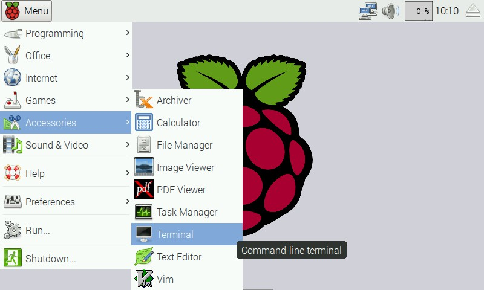

Eight super-bright RGB LED indicators, ideal for adding visual notifications to your Raspberry Pi on their own or on a pHAT stacking header.

Available from Pimoroni: https://shop.pimoroni.com/products/blinkt

##Installation

**Full install ( recommended ):**

We've created a super-easy installation script that will install all pre-requisites and get your Blinkt! up and running in a jiffy. To run it fire up Terminal which you'll find in Menu -> Accessories -> Terminal on your Raspberry Pi desktop like so:



In the new terminal window type:

```bash
curl -sS https://get.pimoroni.com/blinkt | bash
```

If you choose to download examples you'll find them in `/home/pi/Pimoroni/blinkt`.

**Library install for Python 3:**

on Raspbian:

```bash
sudo apt-get install python3-blinkt
```
other environments: 

```bash
sudo pip3 install blinkt
```

**Library install for Python 2:**

on Raspbian:

```bash
sudo apt-get install python-blinkt
```
other environments: 

```bash
sudo pip2 install blinkt
```

In all cases you will have to enable the i2c bus.

##Usage

The two Blinkt methods you'll most commonly use are `set_pixel` and `show`. Here's a simple example:

```
from blinkt import set_pixel, show

set_pixel(0,255,0,0)
show()
```

`set_pixel` takes an optional fifth parameter; the brightness from 0.0 to 1.0.

`set_pixel(pixel_no, red, green, blue, brightness)`

You can also change the brightness with `set_brightness` from 0.0 to 1.0, for example:

```
from blinkt import set_brightness

set_brightness(0.5)
show()
```

##Examples

The examples in the `examples` folder should just work with Blinkt!, although you'll need to add Twitter developer access tokens and secrets in the `twitter_monitor.py` example. You can get these at [https://dev.twitter.com/](https://dev.twitter.com/), after setting up a new application.

The examples in the `examples/extra_examples` folder are designed to work with other pHATs and HATs, so be aware of that before trying them.
